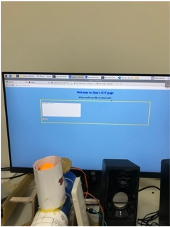
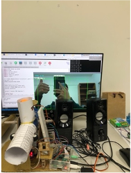
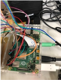
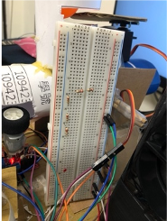
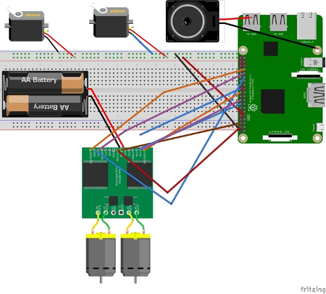
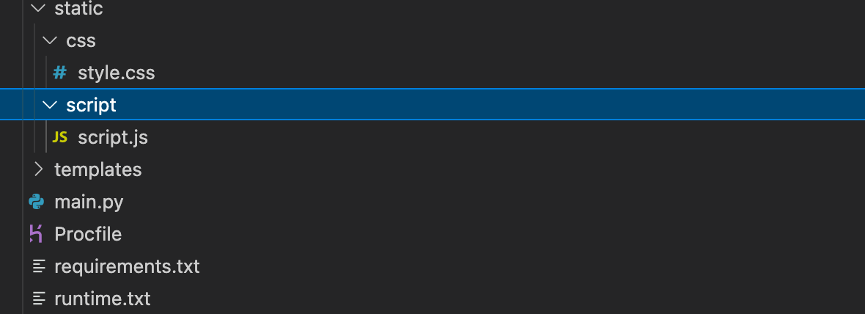
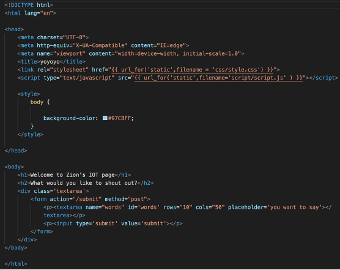
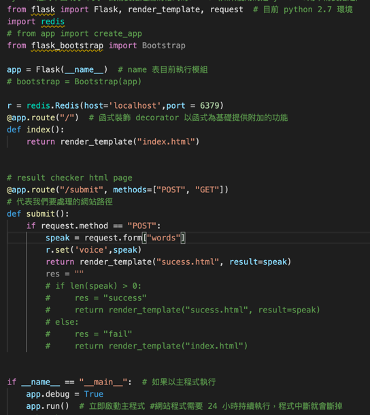
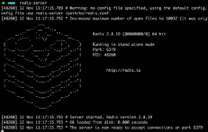
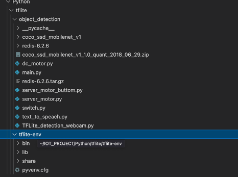

# IoT-Project - Trick or Treat shooter

## 1. Overview/Introduction of the project

### Introduction
---
This is a trick-or-treating tool that allows you to use object recognition detection when you are working. When the boss comes, you don't have to look up, and the speaker will automatically broadcast the word you entered on the webpage we designed to remind employees. Next, the ball machine automatically shoots ball out to colleagues. It is a tool with entertainment and practical effect.

### Object
---

Engineers are too busy and boring at work, and they need tools and trick-or-treating toys that allow them to sneak around but don't want to be caught. This automates tool and toy keeps manual work away and solves the time that requires eyes and hands.

## 2. Preparation

## Step1.Gather your component

### Hardware Components

1.	Raspberry Pi 4 *1
2.	Pi Camera *1
3.	MG996R Servo Motor *2
4.	DC Motor *2
5.	L298N DC Motor Driver *1
6.	Battery Holder *1 (12V)
7.	Multimedia Speaker *1
8.	Dupont Lines *4 (at least)
9.	Table Tennis *N
10.	Tamiya Sponge Tire *2
11.	Paper Rolls / Tape / Cardboard Paper *1
12.	Temperature Hot Melt Adhesive Gun *1

## Picture Detail

1) Webpage

2) Object detection

3) Raspberry pi

4) Breadboard

5) Ball shooter

## Step2:Assemble your circuit

## 3. Write code!
---

### Each component code

## A. IOT MOTOR

### 1) Server motor

#### a. Server motor installed at the bottom will keep rotating until the camera detect boss comes

import RPi.GPIO as GPIO
import time

def server_motor():

    led_pin = 2
    GPIO.setmode(GPIO.BCM)

    #let power to bread
    GPIO.setup(led_pin,GPIO.OUT)
    servol = GPIO.PWM(led_pin,50)
    servol.start(0)

    print('rotate 360 degrees')

    servol.ChangeDutyCycle(3)
    time.sleep(1.4)
    
    GPIO.cleanup()

#### b. When boss comes, then the top server motor will rotate one circle to let the pingpong ball drop down to the ball lane.

import RPi.GPIO as GPIO
import time

def server_motor_buttom(object_name):

    led_pin = 22
    GPIO.setmode(GPIO.BCM)

    #let power to bread
    GPIO.setup(led_pin,GPIO.OUT)
    servol = GPIO.PWM(led_pin,50)
    servol.start(0)

    print('rotate 360 degrees')

    while(object_name != 'person'):
        servol.ChangeDutyCycle(3)
        time.sleep(1.4)
        
    GPIO.cleanup()

### 2) DC motor & L298N driver
---

#### L298N Connect the Battery Holder(12V) and raspberry pi to let two DC motor start rotating at the same time.

import RPi.GPIO as GPIO
from time import sleep

def dc_motor():

    ena = 25
    in1 = 23
    in2 = 24
    enb = 13
    in3 = 5
    in4 = 6

    GPIO.setmode(GPIO.BCM)
    GPIO.setup(ena,GPIO.OUT)
    GPIO.setup(in1,GPIO.OUT)
    GPIO.setup(in2,GPIO.OUT)

    pwm = GPIO.PWM(ena,500)

    GPIO.setup(enb,GPIO.OUT)
    GPIO.setup(in3,GPIO.OUT)
    GPIO.setup(in4,GPIO.OUT)

    pwm2 = GPIO.PWM(enb,500)

    pwm.start(50)
    GPIO.output(in1 , GPIO.LOW)
    sleep(0.1)
    GPIO.output(in2 , GPIO.HIGH)

    pwm2.start(50)
    GPIO.output(in3 , GPIO.LOW)
    sleep(0.1)
    GPIO.output(in4 , GPIO.HIGH)
    sleep(10)
    GPIO.cleanup()

### 3) Text to Speech 
---
-->  pyttsx3 is a text-to-speech conversion library in Python

#### a. Install pyttsx3

$ pip install pyttsx3

##### b. Speak out the text which user enter on the webpage we designed (get the ‘voice’ value from Redis)
---

import pyttsx3
import redis

r = redis.Redis(host='localhost',port = 6379)

def text_to_speach():

    engine = pyttsx3.init()
    engine.setProperty('rate',130)
    text = r.get('voice').decode()
    print(text)
    engine.say(text)
    return engine.runAndWait()

## B. Web development using Flask & Redis for database
---

 
### a. Install Flask

$ pip install Flask

#### design a text area enable user to enter whatever he/she wants the speaker to shout out when boss comes

#### Install Redis to store the text user enter in the text area 

 

## Connect Flask and Redis

## Install Redis

### a. Install Redis
-->  An simple database that only need key and value, it enables us to temporarily store the words entered by the user on the web page and the 

#### 1) Download Redis 
$ wget https://download.redis.io/releases/redis-6.2.6.tar.gz
#### 2) Decompression and cd Redis
$ tar xzf redis-6.2.6.tar.gz
$ cd redis-6.2.6
#### 3) Install and start server
$ make
$ src/redis-server
 

import redis
r = redis.Redis(host='localhost',port = 6379)
r.set('voice',speak)  

## C. Object Detection 

 
### Install TensorFlow Lite and pre-trained object detection model on raspberry pi for us to detect people when they come

#### 1) Create a virtual environment

$ mkdir -p Projects/Python/tflite
$ cd Projects/Python/tflite
$ python -m pip install virtualenv
$ python -m venv tflite-env

#### 2) Activate the tflite-env virtual environment
$ source tflite-env/bin/activate

#### 3) Install libraries

$ sudo apt -y install libjpeg-dev libtiff5-dev libjasper-dev libpng12-dev libavcodec-dev libavformat-dev libswscale-dev libv4l-dev libxvidcore-dev libx264-dev
$ sudo apt -y install qt4-dev-tools libatlas-base-dev libhdf5-103

#### 4) Install OpenCV

$ python -m pip install opencv-contrib-python==4.1.0.25

#### 5) Install TensorFlow Lite in your virtual environment
$ python -m pip install <paste in .whl link>

#### 6) Download Pre-Trained Model
 
$ Download Starter Model and Labels (we use model trained on trained on the COCO dataset.
$ mkdir -p ~/Projects/Python/tflite/object_detection/coco_ssd_mobilenet_v1
$ cd ~/Projects/Python/tflite/object_detection
$ mv ~/Downloads/coco_ssd_mobilenet_v1_1.0_quant_2018_06_29.zip .
$ unzip coco_ssd_mobilenet_v1_1.0_quant_2018_06_29.zip -d coco_ssd_mobilenet_v1

#### 7) Activate
 
$ cd ~/Projects/Python/tflite
$ source tflite-env/bin/activate
$ cd object_detection
$ python TFLite_detection_webcam.py --modeldir=coco_ssd_mobilenet_v1

 
### Add code to monitor each moment if object detection detect person score>65
 
 get the highest score’s object in the score output array
2) if the object score>65 then set ‘label’ key’s value this object name 
3) else set value ‘nono’

## 4. Reference Link
---
https://www.youtube.com/watch?v=0m387MkOyWw
https://devs.tw/post/448
https://www.youtube.com/watch?v=1Ekc6TMeMxU&t=296s
https://www.youtube.com/watch?v=0l9Pu4dk89c
https://blog.csdn.net/wailaizhu/article/details/104479458
https://www.youtube.com/watch?v=2bganVdLg5Q
https://redis.io
